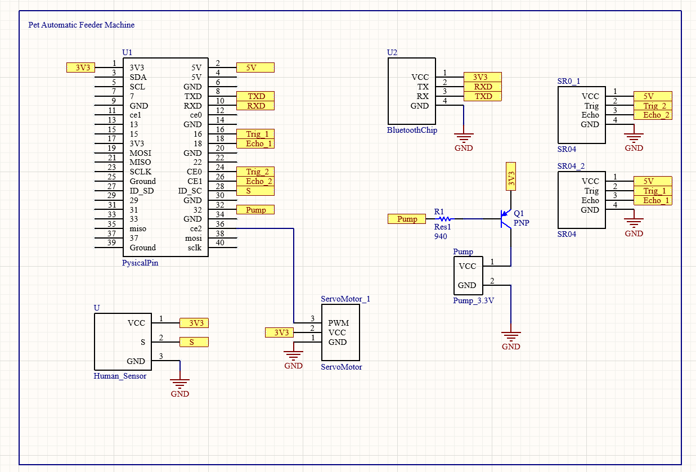

```text
                    Pet Automatic Feeder based on Raspberry Pi 
```


# The Project Introduction

At present, pets are very common family members. But sometimes we have to go out and can't take care of them. What should we do when we are in such a rush? At this time, if there is an automatic feeding machine, it will deeply help us deal with this sad situation. 

So our idea is to design an automatic feeding machine, which can help people feed pets when they are not at home


Next, let's introduce our fifth member Nana:


# APP development Github link
[APP development Github link](https://github.com/Zexuan2815250/Pet-Automatic-Feeder-APP)

## The functions we want to realize


## The functions we really realize


# How many threads we use in this Project

~~~text
Thread_1 :
	SR04 -> no pet Food -> Servo Engine move to fill food
Thread_2 :
	Press Button -> Pump start to fill water
Thread_3 : 
	Bluetooth receive data -> Some actions were taken
		Actions example: Pump works/Servo Engine works
Thread_4:
	Bluetooth chip send data to the Phone
Thread_5:
	The camera works.
Thread_6:
	The weight sensor -> throw the pet food
	Human sensor -> Stop the engine throwing food when cats are there.
~~~


# The Device used in this Project

3 Servo Engines

We use servo motors to control a series of actions in the automatic feeding system, such as opening and closing the lid of the trash bin and dispensing cat food.

The camera



