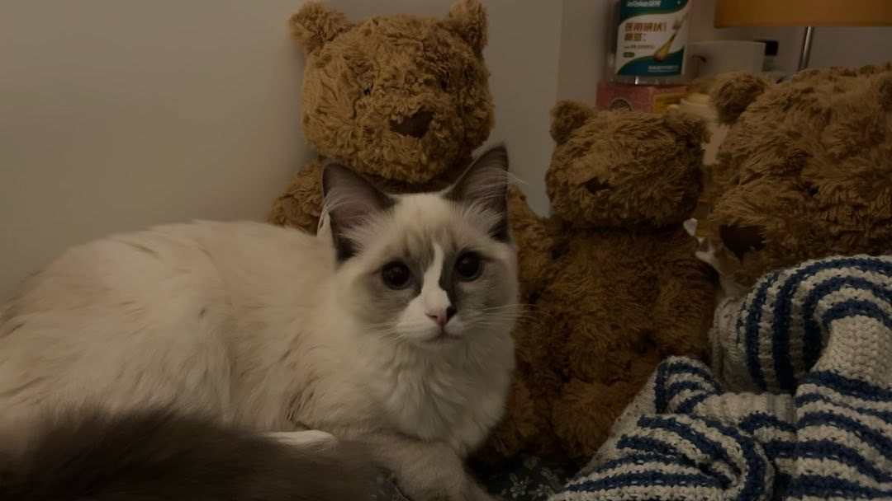
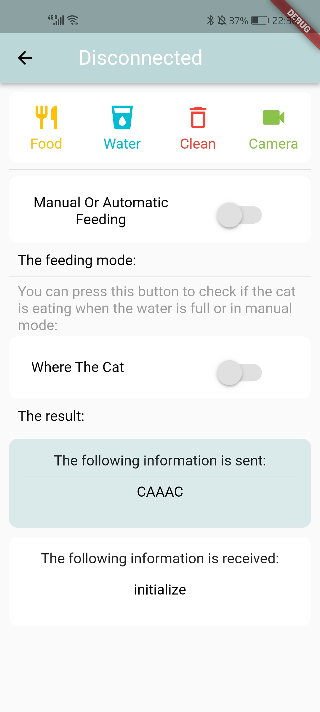

```text
                    Pet Automatic Feeder based on Raspberry Pi 
```

# Our final code for the automatic pet feeder is stored in the Demo folder.

Other folders are used to store other files which are related to this project.


---


# The social Media Link

Please watch our demostration vedio here: [The Automatic Feed Machine Principle Demonstration](https://www.instagram.com/reel/Cq_lPYHAqUB/?utm_source=ig_web_button_share_sheet)

---

# The Project Introduction

~~~text
At present, pets are very common family members. 
But sometimes we have to go out and can't take care of them. 
What should we do when we are in such a rush? 
At this time, if there is an automatic feeding machine, 
it will deeply help us deal with this sad situation. 

So our idea is to design an automatic feeding machine, 
which can help people feed pets when they are not at home.
~~~


---


## Functions of our fully automatic pet feeder

~~~text
1. Automatic Feeding/Manual Feeding Function

   1. When you are away from home, you can use our mobile app to switch to automatic feeding mode. 
   This mode will help you to feed your pet.
   
   2. If you are at home, you can switch to manual feeding mode using our mobile app, 
   so you can provide your pet with a special and customized meal.
   
   3. If you are at home but don't want to feed your pet, 
   you can first switch to automatic feeding mode, wait for the food to fill up, 
   and then switch to manual feeding mode.

   

2. Pet Feeding Detection Function
   This automatic pet feeder is equipped with a human sensor. 
   When you want to know if your pet is eating or somewhere else, 
   you can use our mobile app to check if your cat is near the automatic pet feeder. 
   This greatly facilitates you in finding your pet.


3. Bluetooth Operation Function
   Our machine does not have physical buttons, 
   but all the required button functions are transferred to the mobile app. 
   You can easily operate our machine through our mobile app.


1. 自动喂食/手动喂食 功能

  1. 当您外出不在家时,您可以使用我们的手机应用打开自动喂食模式.此模式会帮你投喂您的宠物.
  
  2. 若您人在家中,则可以使用我们的手机应用切换到手动喂食模式,这样您可以为您的爱宠提供您特特制的美食.
  
  3. 若您人在家中,但不想去喂您的爱宠.则您可以通过先打开自动喂食模式,等食物填满再切换到手动喂食模式.

   

2. 宠物进食检测 功能
   	本自动喂食器配备了人体传感器.
   	当您想知道您的宠物是在进食还是在别的地方时.
   	您可以通过我们的手机应用得知:猫咪是否在自动喂食器附近.这极大的方便了您寻找您的宠物


3. 蓝牙操作 功能
   	我们的机器没有实体按键,而是将所有需要的按键功能都移植到了手机上.
   	你可以通过我们的手机应用非常方便地操作我们的机器.
~~~


---


## How many threads we use in  our code

~~~text
We totally use two threads in our C++ code. 

2 Threads
1 Timer
Some callback funtions

2 threads Below

1. AddFood :
   This thread is specifically designed to handle data transmitted by certain sensors, such as:

​	  Whether the water level is low?
  	Whether the food level is low?
  	Whether the pet is near the machine?

这个线程专门用来处理一些传感器传递回的数据.
例如:
  	水是否少了?
  	食物是否少了?
  	宠物是否在机器附近?


2. BlueSendReceive :
   This thread is dedicated to handling the data received via Bluetooth 
   and sending the required data. 
   All of these functions are triggered by changes to 
   the Bluetooth data within the program.

这个线程专门处理蓝牙接收到的数据的,以及发送需要发送的数据.这一切功能的调用都是通过,程序内蓝牙数据的改变而触发的.
	
~~~


---

# The Circuit Diagram

The Altium Designer project can be found in the folder Circuit_Schematic.


~~~text
This circuit is very simple and there is nothing particularly noteworthy about it, 
except for the circuit of the water pump.

We use a PNP transistor as the switch to turn on/off the pump. 


The main reason is:	

​	The GPIO pin of Raspberry pi can not provide the enough current to drive the pump. 
The current required to drive this water pump is as high as 100mA, 
while the maximum current that our Raspberry Pi pin can provide is only 16mA, 
which is far from enough to drive the water pump.
~~~


A 940 $\Omega$ the resistor is put in the Base of the Transistor.

The reason is :

We have selected a transistor with a gain factor of 45.

The water pump requires a current of 100mA to drive. The transistor requires a voltage of about 0.7V to turn on, and the amplification factor is 100. This means that the voltage applied to the resistor is about 2.6V, and the current is around $\frac{100}{45} = 2.22 mA$. Therefore, the resistor value is about :


$$
\frac{2.6}{2.22*10^{-3}} = 1171 \Omega
$$


We can not find a resistor whose value is 1171. So we connected two 470-ohm resistors in series.


---


## The materials about the device we choose


---

# Directory Structure

I will introduce the Directory Structure of our Project here


---


## Demo Directory Structure

Our Final code is stored in the folder called Demo.


~~~text
- build:
  	This is the folder we store some caches which produced by cmake. 
  	The executable file will also be in this folder.
  	
- include:
  	This folder stores all the head files.
  	
- src:
  	This folder stores all the ssource files
  	
- CMakeLists.txt :
- main.cpp:
  	main Programme
  	
- Readme.md:
  	The file you are reading
~~~

---


## Repository Directory Structure


~~~text
- .vscode:
  	You can ignore this folder

- Circuit_Schematic:
  	The circuit schematic PDF and Project file produced by Altium Designer are put 
  	in this folder.

- Demo:
  	Our final code is in this folder.

​	

- Single Device Unit Test:
  	Mainly stores some device driver class files and some Unit Test Files.
  	
- Thread:
  	At the beginning, 
  	we didn't fully understand what multi-threaded programming and callback functions were. 
  	Therefore, we wrote some projects in this folder to 
  	help us understand multi-threaded programming and callback functions.
  	
- assets:
  	Some image resources
  	
- Readme.md:
  	This file
  	
- Requirements.md:
  	Some Problems I met when i developped the code.
~~~


---


---


# Team member Introduction & Duty Allocation

~~~text
Yi Liu 

Main Duty : 

1. Design the model for our automatic pet feeder. 

2. Build the demo circuit.

3. Provide advice for the code developping

   

   

ZeXuan Li

Main Duty : 

1. Develop our mobile application

2. Take part in the C++ coding

3. Build the demo circuit.

   

Shuai Ran

Main Duty : 

1. Mainly at C++ coding
2. Develop Device Unit test
3. Develop the code with full functions we need
4. Test the Programme


YuLong Liu

Main Duty : 

1. Develop the Device deriver
2. Build the demo circuit
3. Test the circuit
~~~


---


## The fifth team Member

Next, let's introduce our fifth member Nana:




---

# Mobile Application

~~~text
Here I will introduce How to use our Mobile App
~~~


## <u>*Mobile APP development Github link*</u>

~~~text
The code for the mobile application is also available in the zexuan branch of our repository.
~~~

## The demonstration of The mobile Application


~~~text
1. Tap our device name(RanShuai)
2. And the phone will connect to our Automatic Feed machine Bluretooh
3. Then the second page will pop up
~~~




~~~text
The top bar will display the Bluetooth connection status.
~~~


~~~text
This button is used to switch between auto and mannualy fill food mode.
If you are at home, you may want to fill food for your pets by your own.
~~~


~~~text
When the machine is in mannually, you can tap this button.
If you cat is eating, the app will show the mesaage: The cat is enjoying its food.
If you cat is not eating, the app will show the mesaage: The cat is not here.
~~~


# The Problem we met

## During Developing Codes

~~~text
- Strong Current

The strong current generated by the water pump during operation prevents 
other sensors from functioning properly, 
so I decided to make adjustments in the program. 
Each time other sensors are activated, 
the water pump is first turned off.


~~~


## During Assembling the Model

~~~text
- Automatic Feed Machine Model

  Our automatic feeder model was too small, 
  which meant we couldn't put a lot of food and water in it, 
  so we couldn't demonstrate it very well.


- Siphoning

  When building the automatic feeding machine model, 
  we were sucking water from a higher level surface to a lower level surface. 
  However, the water flow continued to flow downwards instead of stopping as we expected. 
  It was only through repeated testing that we discovered the occurrence of siphoning.
~~~

