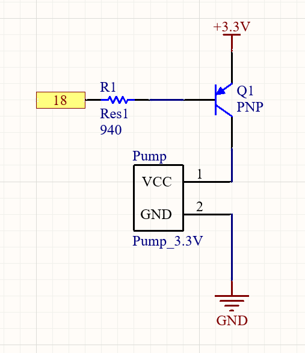

# The circuit explanation

The water pump requires a current of 100mA to drive, but the current that can be provided by the pins of the Raspberry Pi is far less than 100mA. Therefore, we choose an external power supply and a transistor. We use the gain of the transistor to provide enough current to the water pump. At the same time, the base of the transistor is connected to the Raspberry Pi pin as a switch.

The res is used to limit the current of the Base current to make the PNP safe.

Blow is the specific circuit

